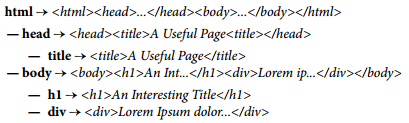
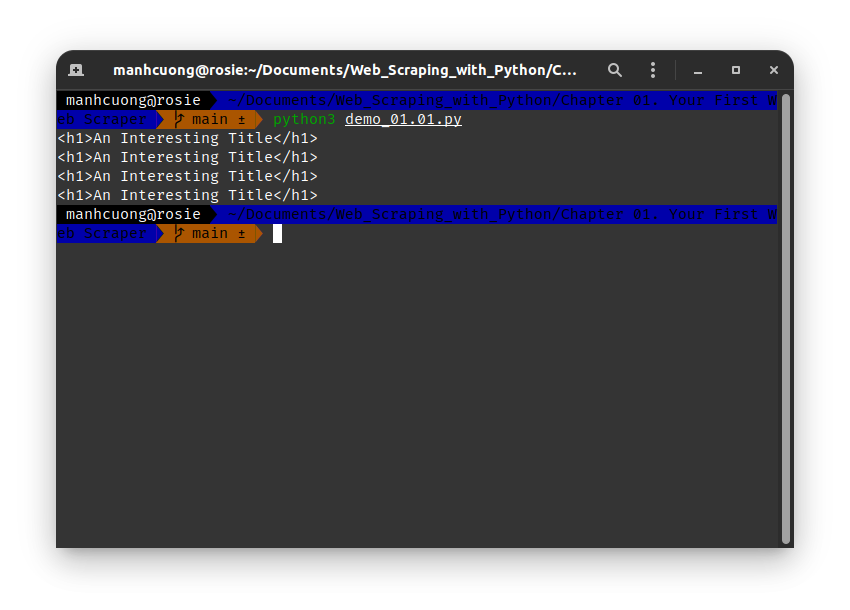
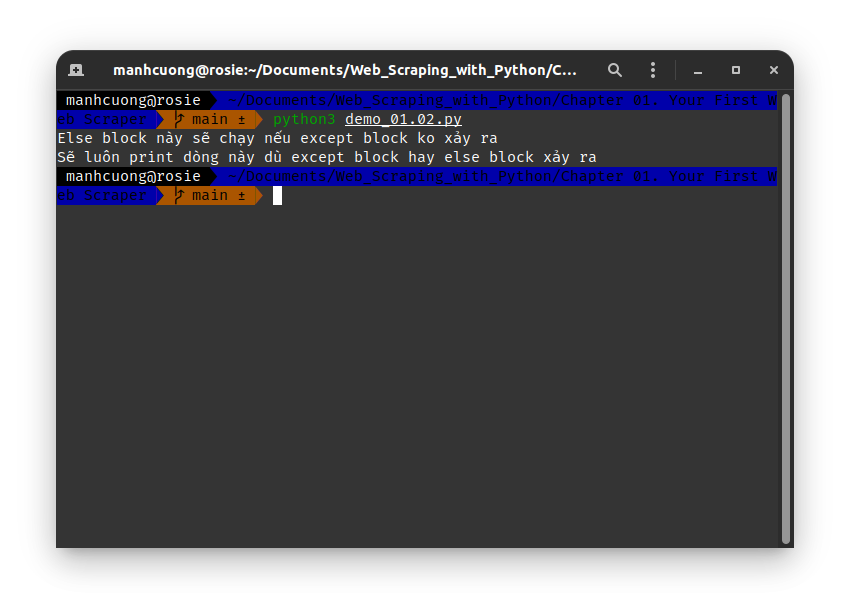
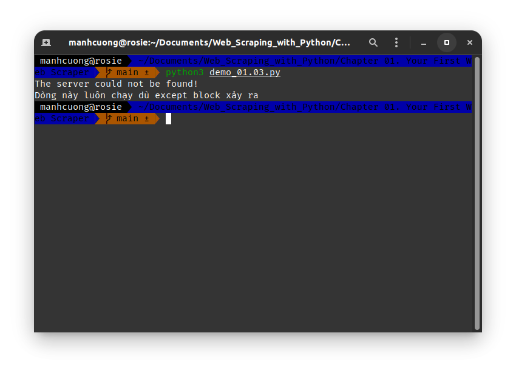
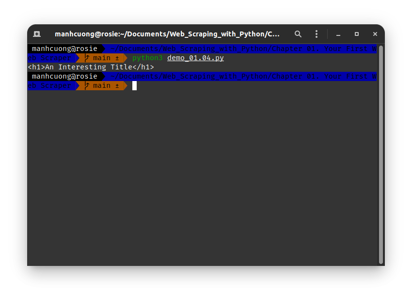

# 1. Connecting
* Trang web [http://pythonscraping.com/pages/page1.html](http://pythonscraping.com/pages/page1.html)
  

* Code dưới đây sẽ lấy toàn bộ mã HTML của trang web trên.
###### [demo_01.00.py](demo_01.00.py)
```python
from urllib.request import urlopen

html = urlopen("http://pythonscraping.com/pages/page1.html")
print(html.read())
```


# 2. An Introduction to BeautifulSoup
* Thư viện này dùng để xử lí các mã HTML khi crawl dữ liệu từ web về.
  
## 2.1. Installing BeautifulSoup
* Mở terminal và chạy lệnh `pip3 install beautifulsoup4`.
  

## 2.2. Running BeautifulSoup
* Đoạn code dưới đây trả về thẻ **`h1`** đầu tiên được tìm thấy trên trang cùng với content bên trong thẻ này.
* Dòng code dưới đây chuyển `html` thành object BeautifulSoup:
  ```python
  bs = BeautifulSoup(html, 'html.parser')
  ```
  từ đây có thể truy cập vào các HTML element bằng các cách dưới đây:
  
* Dưới đây là toàn bộ mã nguồn:
###### [demo_01.01.py](demo_01.01.py)
```python
from urllib.request import urlopen
from bs4 import BeautifulSoup

html = urlopen('http://www.pythonscraping.com/pages/page1.html')
bs = BeautifulSoup(html.read(), 'html.parser') 
print(bs.h1)

# 3 lệnh này tương ứng vs lệnh trên
print(bs.html.body.h1)
print(bs.body.h1)
print(bs.html.h1)
```


* Ngoài option là `html.parser`, còn có option cải tiến hơn là `lxml` (nhớ install bằng lệnh `pip3 install lxml`) - phiên bản này cải tiến hơn `html.parser` là có thể bắt các thẻ HTMl bị lỗi, đóng mở không đúng cách, thiếu thẻ `<head>`, `<body>` và nhanh hơn. Một phiên bản cải tiến siêu cấp vũ trụ là `html5lib` (nhớ install bằng `pip3 install html5lib`) bắt lỗi tốt nhất đồng thời cũng chậm nhất.

## 2.3. Connecting Reliably and Handling Exceptions
* Đôi khi trong quá trình crawl data sẽ gặp các lỗi ngoại lệ do website bạn crawl được cài đặt đặc biệt hay vì lí do xàm xí nào đó, lúc này quá trình crawl sẽ bị ngắt, nhưng ta vẫn muốn tiếp tục nếu gặp lỗi thì sẽ ignore nó, dưới đây là vài đoạn code demo.

###### [demo_01.02.py](demo_01.02.py)
```python
from urllib.request import urlopen
from urllib.error import HTTPError

try:
    html = urlopen("http://www.pythonscraping.com/pages/page1.html")
except HTTPError as err:
    print(err)
else:
    print("Else block này sẽ chạy nếu except block ko xảy ra")

print("Sẽ luôn print dòng này dù except block hay else block xảy ra")
```


###### [demo_01.03.py](demo_01.03.py)
```python
from urllib.request import urlopen
from urllib.error import HTTPError
from urllib.error import URLError

try:
    html = urlopen('https://pythonscrapingthisurldoesnotexist.com')
except HTTPError as err:
    print(err)
except URLError as err:
    print('The server could not be found!')
else:
    print('It Worked!')
    
print("Dòng này luôn chạy dù except block xảy ra")
```


<hr>

* Khi crawl dữ liệu, ta sẽ ko thể biết dc trang web đó chứa các HTML element nào để mà ta có thể truy xuất, trong tình huống như vậy, để đảm bảo code ko bị crash, ta thực hiện như sau:

###### [demo_01.04.py](demo_01.04.py)
```python
from urllib.request import urlopen
from urllib.error import HTTPError
from bs4 import BeautifulSoup

def getTitle(url: str) -> str:
    try:
        html = urlopen(url)
    except HTTPError as err:
        return None
    
    try:
        bs = BeautifulSoup(html.read(), 'html5lib')
        title = bs.body.h1
        
    except AttributeError as err:
        return None
    
    return title

title = getTitle('http://www.pythonscraping.com/pages/page1.html')
if title == None:
    print('Không có title')
else:
    print(title)
```
