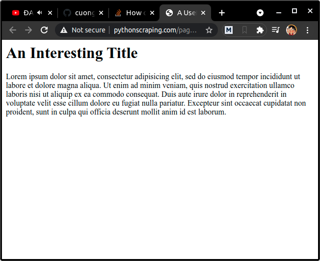
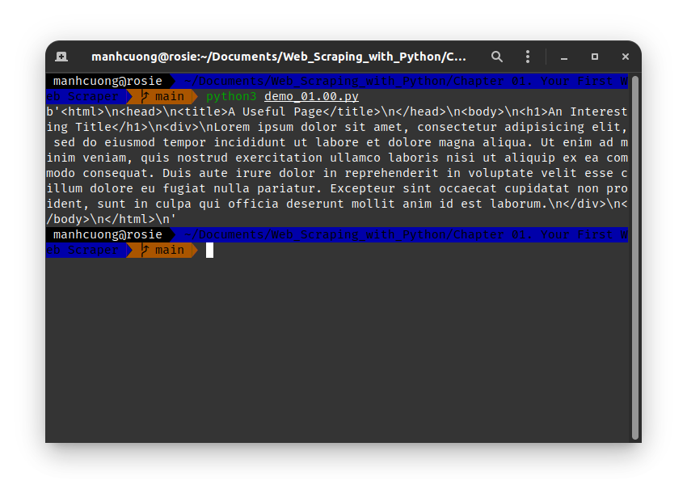
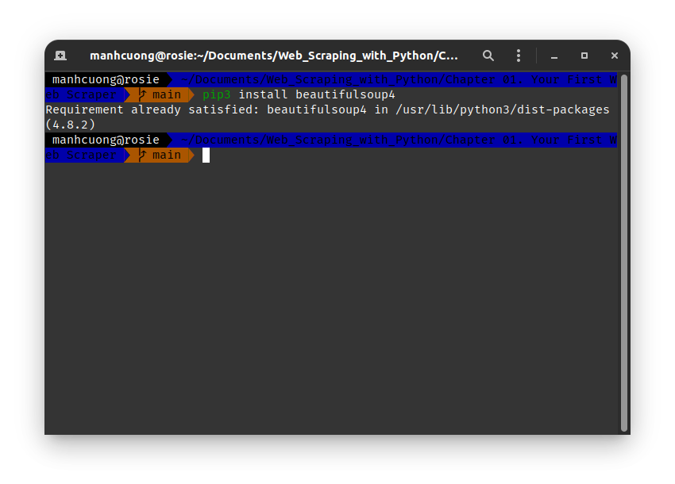

# 1. Connecting
* Trang web [http://pythonscraping.com/pages/page1.html](http://pythonscraping.com/pages/page1.html)
  

* Code dưới đây sẽ lấy toàn bộ mã HTML của trang web trên.
###### [demo_01.00.py](demo_01.00.py)
```python
from urllib.request import urlopen

html = urlopen("http://pythonscraping.com/pages/page1.html")
print(html.read())
```


# 2. An Introduction to BeautifulSoup
* Thư viện này dùng để xử lí các mã HTML khi crawl dữ liệu từ web về.
  
## 2.1. Installing BeautifulSoup
* Mở terminal và chạy lệnh `pip3 install beautifulsoup4`.
  

## 2.2. Running BeautifulSoup
