# 1. You Don’t Always Need a Hammer
* Đôi khi việc bàn cần lấy thông tin trong một đống các thẻ HTML lồng nhau mà nếu mấy thằng gà viết sẽ như thế này:
  ```python
  bs.find_all('table')[4].find_all('tr')[2].find('td').find_all('div')[1].find('a')
  ```
  OK, đồng ý là ko sai nhưng nó xấu quá chời vs nhìn ko dc bờ-rồ cho lắm. Rồi vào một ngày đẹp trời, quản trị viên của web nơi bạn crawl dữ liệu thay đổi cấu trúc HTML của trang web thì cái mớ code trên sẽ đi bụi...

# 2. Another Serving of BeautifulSoup
* Đôi khi, ko nhất thiết ta cứ việc phải bấm vào các HTML element để crawl data, ta có thể crawl data dựa vào **class** và **id** của CSS.
* Dưới đây là trang web ví dụ cho phần này: [http://www.pythonscraping.com/pages/warandpeace.html](http://www.pythonscraping.com/pages/warandpeace.html)
  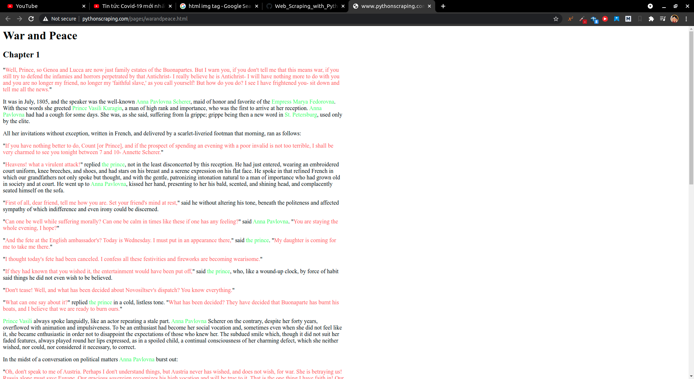

* Đoạn code dưới đây sẽ tìm kiếm mọi thẻ **`span`** mà có class là **`green`**, sau đó lấy nội dung bên trong các thẻ span đó:

###### [demo_02.00.py](demo_02.00.py)
```python
from urllib.request import urlopen
from bs4 import BeautifulSoup

html = urlopen("http://www.pythonscraping.com/pages/warandpeace.html")
bs = BeautifulSoup(html.read(), "html5lib")
name_list = bs.findAll('span', {'class':'green'}) # tìm tất cả thẻ `span` mà có class là `green`

for name in name_list:
    print(name.get_text())
```
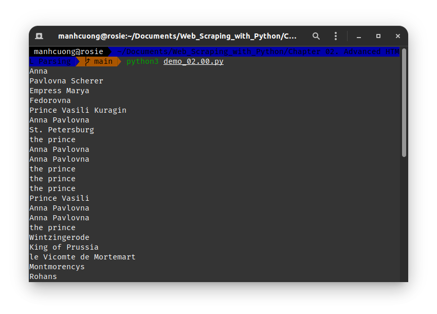

## 2.1. `find()` and `find_all()` with BeautifulSoup

```python
find_all(<tag>, <attributes>, <recursive>, <text>, <limit>, <keywords>)
find(<tag>, <attributes>, <recursive>, <text>, <keywords>)
```
* **`<tag>`**: có thể truyền vào đối số là `str` hoặc là `List[str]`, ví dụ:
  ```python
  find_all(['h1', 'h2', 'h3'])
  ```
    ###### [demo_02.01.py](demo_02.01.py)
    ```python
    from urllib.request import urlopen
    from bs4 import BeautifulSoup

    html = urlopen("http://www.pythonscraping.com/pages/warandpeace.html")
    bs = BeautifulSoup(html.read(), "html5lib")
    name_list = bs.find_all(['h1', 'h2', 'h3', 'h4', 'h5', 'h6'])

    for name in name_list:
        print(name)
    ```
    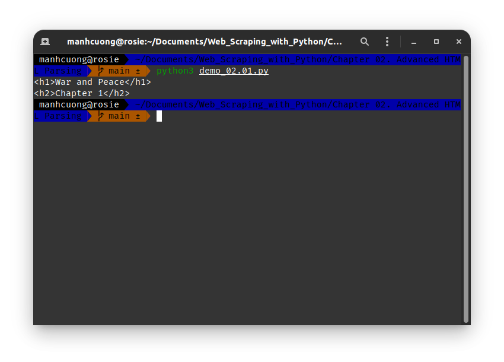

* **`<attributes>`**: tham số này nhận đối số là một `Dict[str, *List[str]]`, ví dụ dưới đây có **`<tag>`** là `span` với **`attributes`** là các class **`green`** và **`red`**.
  ```python
  .find_all('span', {'class':{'green', 'red'}})
  ```

    ###### [demo_02.02.py](demo_02.02.py)
    ```python
    from urllib.request import urlopen
    from bs4 import BeautifulSoup

    html = urlopen("http://www.pythonscraping.com/pages/warandpeace.html")
    bs = BeautifulSoup(html.read(), "html5lib")
    name_list = bs.find_all('span', {'class':('green', 'red')})

    for name in name_list:
        print(name)
    ```
    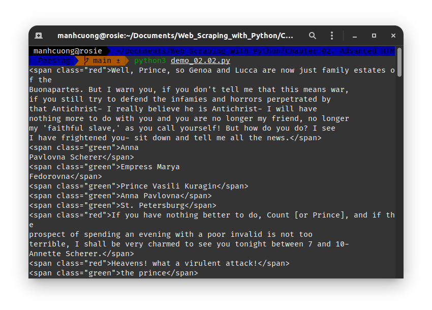
* **`<recursive>`**: default là **`True`**, nó sẽ đào sâu vào tất cả các thẻ HTML để tìm, còn nếu là **`False`**, nó chỉ tìm trong thẻ HTML cấp cao nhất trong cây cấu trúc HTML của trang web của bạn sau đó dừng ko tìm nữa.
* **`<text>`**: nhận đối số là `str`, tìm kiếm dựa trên content của các thẻ HTML của đối số cần tìm:
  ```python
  .find_all(text="the prince")
  ```
    ###### [demo_02.03.py](demo_02.03.py)
    ```python
    from urllib.request import urlopen
    from bs4 import BeautifulSoup

    html = urlopen("http://www.pythonscraping.com/pages/warandpeace.html")
    bs = BeautifulSoup(html.read(), "html5lib")
    name_list = bs.find_all(text="the prince")

    print(">> len(name_list) = {}".format(len(name_list)))
    for name in name_list:
        print(name)
    ```
    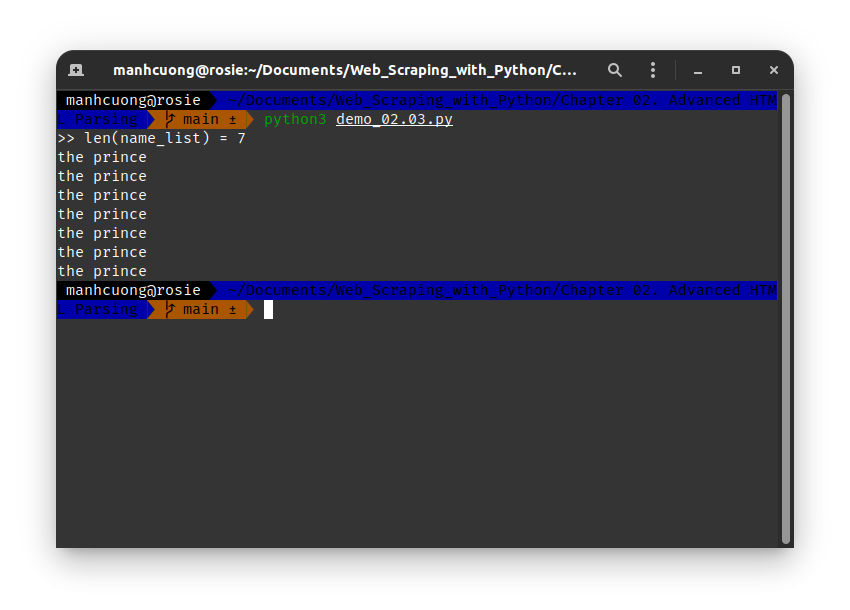

* **`<limit>`**: giới hạn số thẻ cần tìm
    ###### [demo_02.04.py](demo_02.04.py)
    ```python
    from urllib.request import urlopen
    from bs4 import BeautifulSoup

    html = urlopen("http://www.pythonscraping.com/pages/warandpeace.html")
    bs = BeautifulSoup(html.read(), "html5lib")
    name_list = bs.find_all('span', {'class':('green', 'red')}, limit=7)

    print(">> len(name_list) = {}".format(len(name_list)))
    for name in name_list:
        print(name)
    ```
    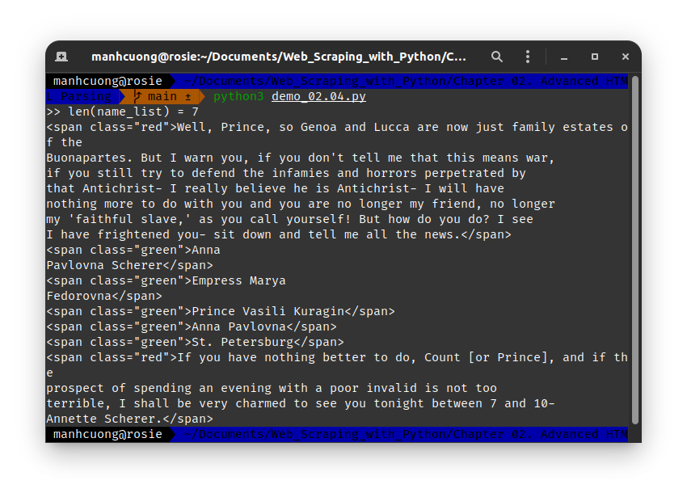

* **`<keyword>`**: cái này ra đời ai cũng chửi, như shit vậy, khỏi tìm hiểu nhảm lắm, mấy cái trên đủ sài rồi.

## 2.2. Other BeautifulSoup Objects
## 2.3. Navigating Trees
* Xem xét trang web [http://www.pythonscraping.com/pages/page3.html](http://www.pythonscraping.com/pages/page3.html)
  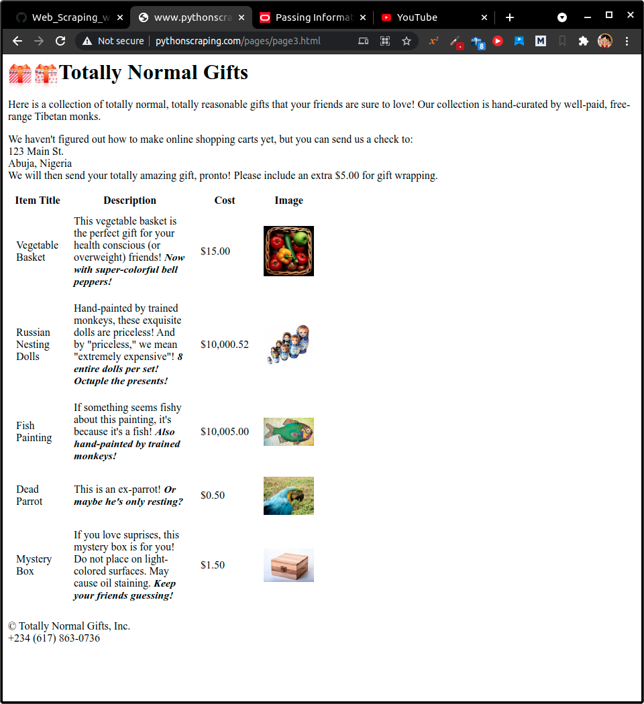
* Dưới đây là cấu trúc cây HTML của web trên:
  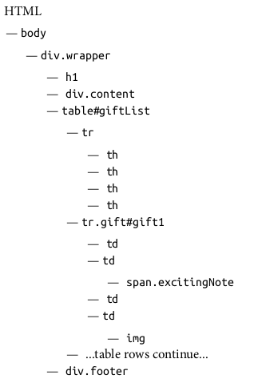
* Trong đây, thẻ **tr** là con của thẻ **table** và **tr**, **th**, **td**, **img** và **span** đều là cháu của thẻ **table**. Tức **tất cả con** đều là **cháu** nhưng chưa chắc **cháu** là **con**.
  
* Code này lấy tất cả thẻ con:
###### [demo_02.05.py](demo_02.05.py)
```python
from urllib.request import urlopen
from bs4 import BeautifulSoup

html = urlopen('http://www.pythonscraping.com/pages/page3.html')
bs = BeautifulSoup(html, 'html.parser')

for child in bs.find('table',{'id':'giftList'}).children:
    print(child)
```
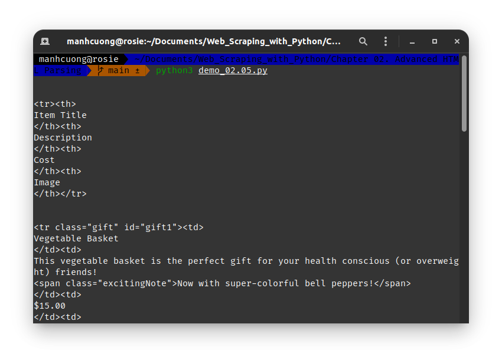

* Lấy tất cả thẻ cháu:
###### [demo_02.06.py](demo_02.06.py)
```python
from urllib.request import urlopen
from bs4 import BeautifulSoup

html = urlopen('http://www.pythonscraping.com/pages/page3.html')
bs = BeautifulSoup(html, 'html.parser')

for descendant in bs.find('table',{'id':'giftList'}).descendants:
    print(descendant)
```
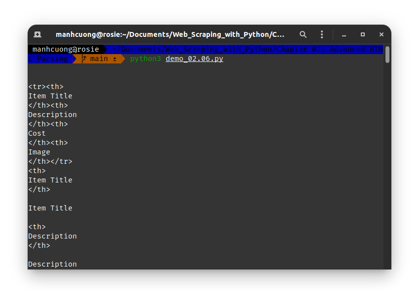

* Code dưới đây demo **`next_siblings`**, tức lấy các thẻ em của thẻ hiện tại:
###### [demo_02.07.py](demo_02.07.py)
```python
from urllib.request import urlopen
from bs4 import BeautifulSoup

html = urlopen('http://www.pythonscraping.com/pages/page3.html')
bs = BeautifulSoup(html, 'html.parser')

for sibling in bs.find('table', {'id':'giftList'}).tr.next_siblings:
    print(sibling)
```
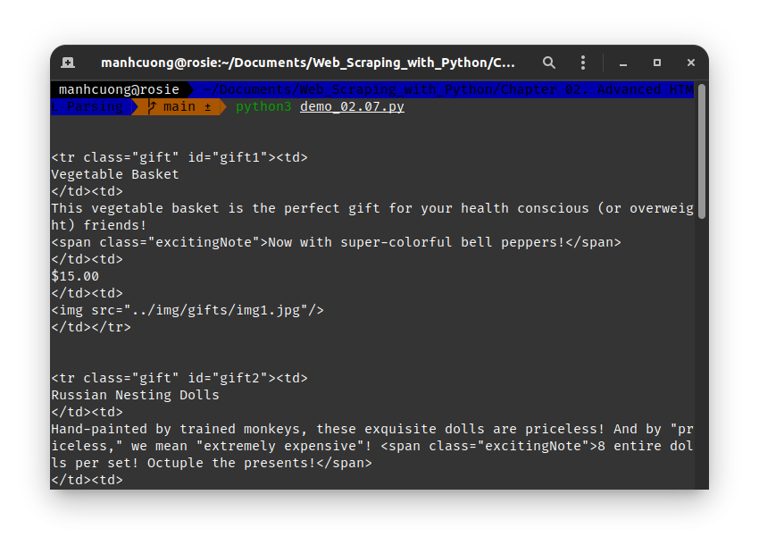

* Code này lấy thẻ tất cả các thẻ con của thẻ **`tr`** đầu tiên:
###### [demo_02.08.py](demo_02.08.py)
```python
from urllib.request import urlopen
from bs4 import BeautifulSoup

html = urlopen('http://www.pythonscraping.com/pages/page3.html')
bs = BeautifulSoup(html, 'html.parser')

for sibling in bs.find('table', {'id':'giftList'}).tr:
    print(sibling)
```
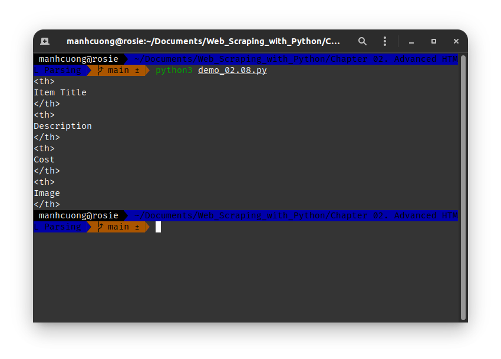

* Code này lấy tất cả thẻ anh chị của thẻ hiện tại bằng **`previous_siblings`**:
###### [demo_02.09.py](demo_02.09.py)
```python
from urllib.request import urlopen
from bs4 import BeautifulSoup

html = urlopen('http://www.pythonscraping.com/pages/page3.html')
bs = BeautifulSoup(html, 'html.parser')

for sibling in bs.find('tr', {'class':'gift'}).previous_siblings:
    print(sibling)
```
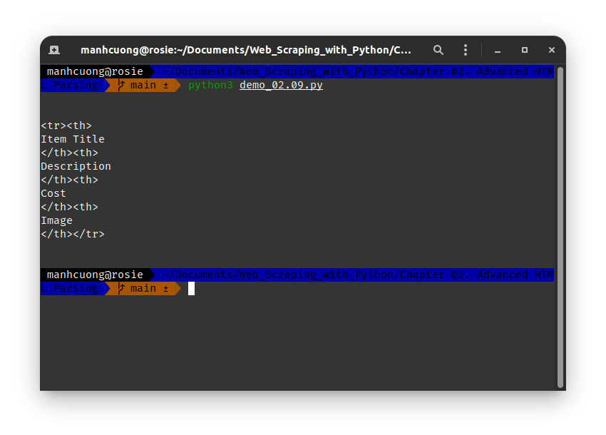

* Ngoài ra còn có **`next_sibling`** và **`previous_sibling`** thì nó tương tự như **`next_siblings`** và **`previous_siblings`** nhưng lúc này nó chỉ trả về thẻ em và anh chị đầu tiên nó tìm được.

* Code này lấy thẻ cha của thẻ hiện tại, sau đó lấy thẻ anh chị của thẻ cha này:
###### [demo_02.10.py](demo_02.10.py)
```python
from urllib.request import urlopen
from bs4 import BeautifulSoup

html = urlopen('http://www.pythonscraping.com/pages/page3.html')
bs = BeautifulSoup(html, 'html.parser')

print(bs.find('img', {'src':'../img/gifts/img1.jpg'}).parent.previous_sibling.get_text())
```
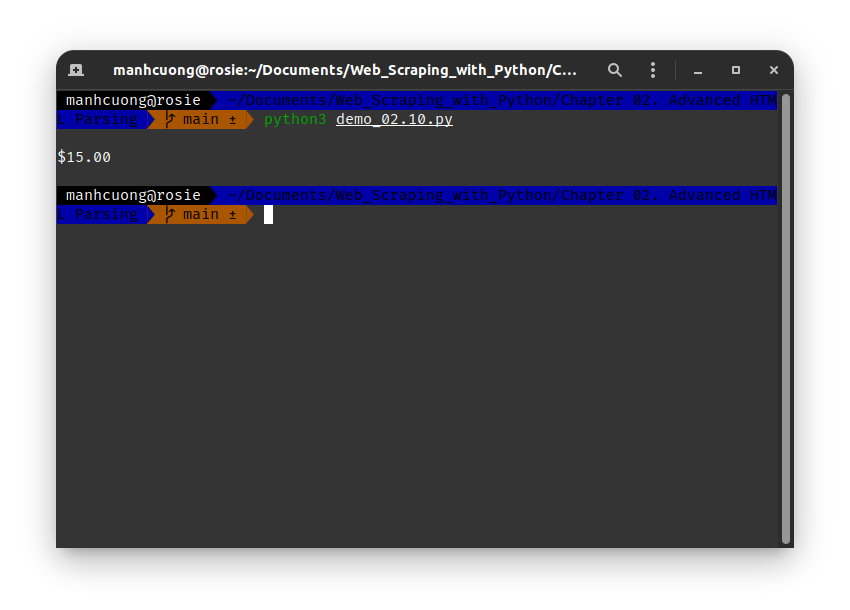

# 3. Regular Expressions
* Giả sử ta có một chuổi với các bước sau:
  * 1. Viết kí tự **a** ít nhất 1 lần.
  * 2. Sau đó viết kí tự **b** chính xác 5 lần.
  * 3. Sau đó thêm kí tự **c** vào miễn sao số lần **c** đếm được là số chẳn.
  * 4. Viết kí tự **d** hoặc **e** vào cuối.
* Theo quy tắc này, chuổi có thể là **aaaabbbbbccccd**, **aabbbbbcce**,...
* Đây là chuổi regex để phù hợp với chuổi trên: `aa*bbbbb(cc)*(d|e)`
* Các kí hiệu mà regex hay dùng:
  
|Kí hiệu|Mô tả|Ví dụ|Các chuổi phù hợp với ví dụ|
|-|-|-|-|
|**`*`**|Khớp với kí tự, biểu thức đứng trước, sao cho kí tự hoặc biểu thức này xuất hiện 0 hoặc nhiều lần.|`a*b*`|aaaaaaaa, aaabbbbb, bbbbbb|
|**`+`**|Khớp với kí tự, biểu thức đứng trước, sao cho kí tự hoặc biểu thức này xuất hiện ít nhất 1 lần.|`a+b+`|aaaaaaaab, aaabbbbb, abbbbbb|
|**`[]`**|Khớp với bất kì kí tự nào nằm trong cặp ngoặc vuông này (tức là khớp với một kí tự bất kì trong những kí tự này).|`[A-Z]*`|APPLE, CAPITALS, QWERTY|
|**`()`**|Một biểu thức.|`(a*b)*`|aaabaab, abaaab, ababaaaaab|
|**`{m, n}`**|Khớp với kí tự, biểu thức đứng trước, sao cho kí tự hoặc biểu thức xuất hiện từ **[m, n]** lần.|`a{2, 3}b{2, 3}`|aabbb, aaabbb, aabb|
|**`[^]`**|Khớp với kí tự, biểu thức nào sao cho kí tự hoặc biểu thức này **không nằm** trong cặp ngoặc vuông|`[^A-Z]*`|apple, lowercase, qwerty|
|**`|`**|Khớp với kí tự, biểu thức nào sao cho các kí tự và biểu thức này phân tách nhau bởi dấu **`|`** sao cho **chỉ một** kí tự hoặc một biểu thức xuất hiện.|`b(a|i|e)d`|bad, bid, bed|
|**`^`**|Khớp với kí tự, biểu thức **đứng sau** sao cho kí tự hoặc biểu thức này **phải xuất hiện ở đầu chuổi**.|`^a`|apple, asdf, a|
|**`\`**|Giống trong lập trình Java, bạn không thể print ra dấu **`"`** với dòng code sau: `System.out.print(""")`, sẽ bị lỗi, để print dấu **`"`**, thì sài dòng code này `System.out.print("\"")`, thì kí tự này dùng để làm điều này.|`\.\|\\`| .\|\\|
|**`.`**|Khớp với bất kì kí tự đơn nào (bao gồm kí hiệu đặc biệt, số, dấu cách,...).|`b.d`|bad, bzd, b$d, b d|
|**`$`**|Đặt cuối chuổi sao cho khớp với kí tự, biểu thức đứng trước nó sao cho kí tự hoặc biểu thức này phải xuất hiện cuối chuổi. Kí tự này tương đường với **`.*`** khi được đặt cuối chuổi.|`[A-Z]*[a-z]*$`|ABCabc, zzzyx, Bob|
|**`(?!<kí tự, biểu thức>)`**|Không chứa kí tự hoặc biểu thức phía sau nó trong chuổi lớn hơn, chung này sài nhiều hiểu chứ ko biết giải thích|`^((?![A-Z]).)*$`|no-caps-here, $ymb0ls a4e f!ne|

* Dưới đây là mẫu regex dùng kiểm tra email:
  `[A-Za-z0-9\._+]+@[A-za-z]+\.(com|org|edu|net)`

# 4. Regular Expressions and BeautifulSoup
