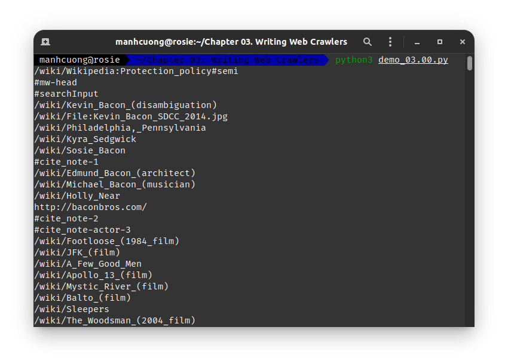
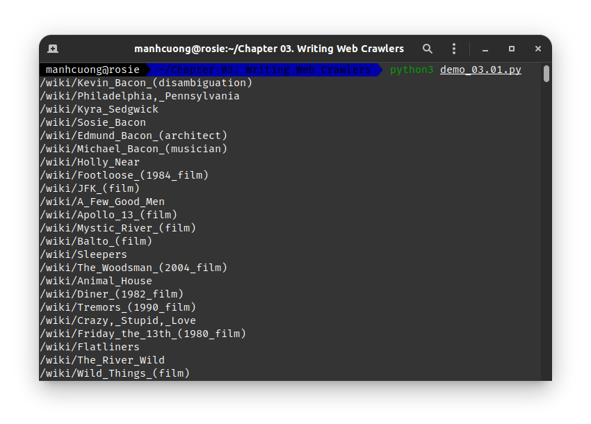
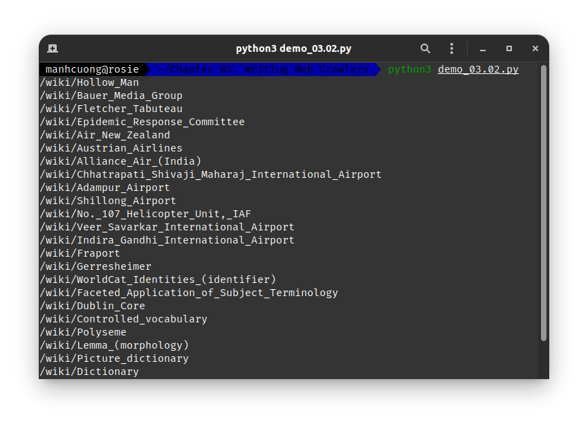
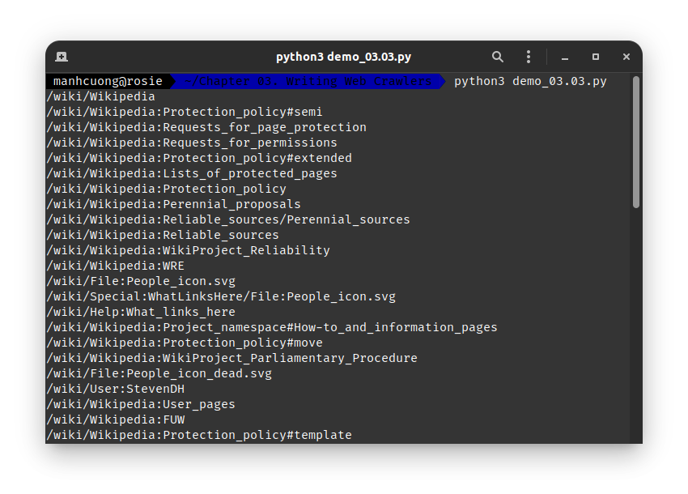
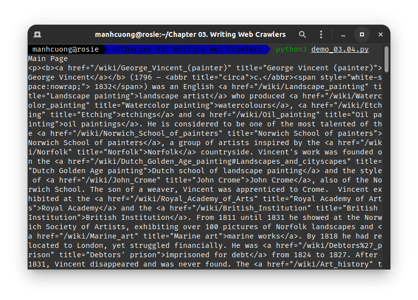
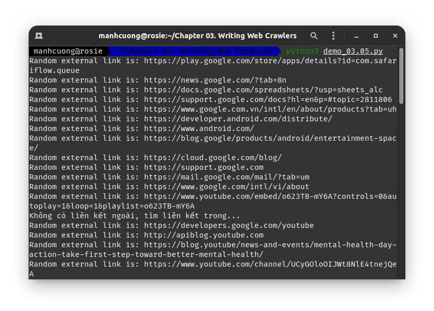
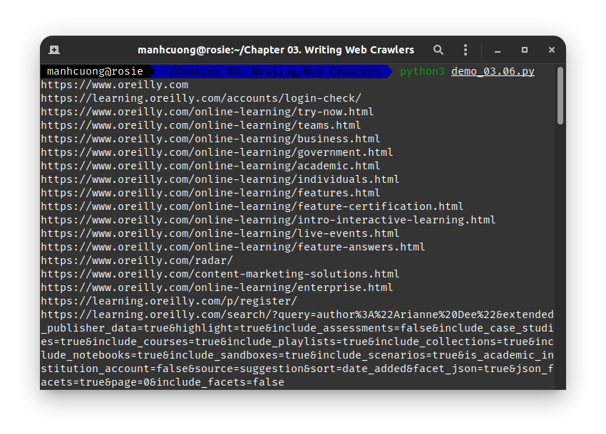

# 1. Traversing a Single Domain
* Code dưới đây sẽ tìm tất cả các URL có trong các thẻ **`<a/>`**:
###### [demo_03.00.py](demo_03.00.py)
```python
from urllib.request import urlopen
from bs4 import BeautifulSoup

html = urlopen('http://en.wikipedia.org/wiki/Kevin_Bacon')
bs = BeautifulSoup(html, 'html.parser')

for link in bs.find_all('a'):
    if 'href' in link.attrs:
        print(link.attrs['href'])
```


* Các URL mà ta cần quan tâm nằm trong class `bodyContent` và các URL này bắt đầu bằng `/wiki/` và ko dc chứa kí tự `:` bên trong, nên regex sẽ là: `^(/wiki/)((?!:).)*$")`:
###### [demo_03.01.py](demo_03.01.py)
```python
from urllib.request import urlopen
from bs4 import BeautifulSoup
import re

html = urlopen('http://en.wikipedia.org/wiki/Kevin_Bacon')
bs = BeautifulSoup(html, 'html.parser')

for link in bs.find('div', {'id':'bodyContent'}).find_all('a', href=re.compile('^(/wiki/)((?!:).)*$')):
    if 'href' in link.attrs:
        print(link.attrs['href'])
```

  Trên đây là tất cả các URL mà Kevin Bacon liên kết đến.

* Tuy nhiên ta có thể code gọn hơn và đỉnh hơn bằng cách đi đến mọi URL mà Kevin Bacon và các trang con, cháu, chắc liên của Keven Bacon liên kết đến:
###### [demo_03.02.py](demo_03.02.py)
```python
from urllib.request import urlopen
from bs4 import BeautifulSoup
import datetime
import random
import re

random.seed(datetime.datetime.now())
def getLinks(articleUrl):
    html = urlopen('http://en.wikipedia.org{}'.format(articleUrl))
    bs = BeautifulSoup(html, 'html.parser')
    
    return bs.find('div', {'id':'bodyContent'}).find_all('a', href=re.compile('^(/wiki/)((?!:).)*$'))

links = getLinks('/wiki/Kevin_Bacon')
while len(links) > 0:
    newArticle = links[random.randint(0, len(links)-1)].attrs['href']
    
    print(newArticle)
    
    links = getLinks(newArticle)
```


# 2. Crawling an Entire Site
* Code dưới đây dùng để truy cập vào tất cả các URL và các URL phát sinh có thể có trên trang Wikipedia:
###### [demo_03.03.py](demo_03.03.py)
```python
from urllib.request import urlopen
from bs4 import BeautifulSoup
import re

pages = set()

def getLinks(pageUrl):
    global pages
    
    html = urlopen('http://en.wikipedia.org{}'.format(pageUrl))
    bs = BeautifulSoup(html, 'html.parser')
    
    for link in bs.find_all('a', href=re.compile('^(/wiki/)')):
        if 'href' in link.attrs:
            if link.attrs['href'] not in pages:
                newPage = link.attrs['href']
                pages.add(newPage)
                
                print(newPage)
                getLinks(newPage)
    
getLinks('')
```

  tuy nhiên ngôn ngữ Python bị đặt giới hạn về đệ quy, khi các liên kết đủ sâu (cỡ 1000 liên kết) thì chương trình có thể bị crash.

## 2.1. Collecting Data Across an Entire Site
* Code dưới đây dùng để đi đến một URL bất kì, sau đó crawl data từ trang đó rồi tiếp tục đi đến trang khác crawl data and so on...
###### [demo_03.04.py](demo_03.04.py)
```python
from urllib.request import urlopen
from bs4 import BeautifulSoup
import re

pages = set()

def getLinks(pageUrl):
    global pages
    
    html = urlopen('http://en.wikipedia.org{}'.format(pageUrl))
    bs = BeautifulSoup(html, 'html.parser')
    
    try:
        print(bs.h1.get_text())
        print(bs.find(id ='mw-content-text').find_all('p')[0])
        print(bs.find(id='ca-edit').find('span').find('a').attrs['href'])
    except AttributeError:
        print('This page is missing something! Continuing.')
        
        for link in bs.find_all('a', href=re.compile('^(/wiki/)')):
            if 'href' in link.attrs:
                if link.attrs['href'] not in pages:
                    newPage = link.attrs['href']
                    print('-'*20)
                    print(newPage)
                    pages.add(newPage)
                    getLinks(newPage)
                    
getLinks('')
```


# 3. Crawling Across the Internet
* Code dưới đây dùng để truy cập vào tất cả liên kết ngoài của trang web hiện tại, đồng thời có thể truy cập vào các liên kết trong của các web rồi truy xuất vào các liên kết ngoài:
###### [demo_03.05.py](demo_03.05.py)
```python
from urllib.request import urlopen
from urllib.parse import urlparse
from bs4 import BeautifulSoup
import re
import datetime
import random

pages = set()
random.seed(datetime.datetime.now())

# Trả về tất cả các đường dẫn hiện có trên một trang cụ thể
def getInternalLinks(bs, includeUrl):
    includeUrl = '{}://{}'.format(urlparse(includeUrl).scheme, urlparse(includeUrl).netloc)
    """
    .scheme: trả về `str` cho biết là http hay https
    .netloc: trả về địa chỉ thuẩn chủng của trang, ví dụ facebook.com/cuongpiger thì chỉ trả về facebook.com thôi
    """
    internalLinks = []
    # tìm tất cả các đường dẫn bắt đầu với "/"
    for link in bs.find_all('a', href=re.compile('^(/|.*'+includeUrl+')')):
        if link.attrs['href'] is not None:
            if link.attrs['href'] not in internalLinks:
                if(link.attrs['href'].startswith('/')):
                    internalLinks.append(includeUrl+link.attrs['href'])
                else:
                    internalLinks.append(link.attrs['href'])
    
    return internalLinks

# Truy xuất đến tất cả các liên kết ngoài trên 1 trang cụ thể
def getExternalLinks(bs, excludeUrl):
    externalLinks = []
    # tìm kiếm tất cả các URL bắt đầu bằng http mà ko chứa url hiện tại
    for link in bs.find_all('a', href=re.compile('^(http|www)((?!'+excludeUrl+').)*$')):
        if link.attrs['href'] is not None:
            if link.attrs['href'] not in externalLinks:
                externalLinks.append(link.attrs['href'])
    
    return externalLinks

def getRandomExternalLink(startingPage):
    html = urlopen(startingPage)
    bs = BeautifulSoup(html, 'html.parser')
    externalLinks = getExternalLinks(bs, urlparse(startingPage).netloc)
    
    if len(externalLinks) == 0:
        print('Không có liên kết ngoài, tìm liên kết trong...')
        
        domain = '{}://{}'.format(urlparse(startingPage).scheme, urlparse(startingPage).netloc)
        internalLinks = getInternalLinks(bs, domain)
        
        return getRandomExternalLink(internalLinks[random.randint(0, len(internalLinks)-1)])
    else:
        return externalLinks[random.randint(0, len(externalLinks)-1)]
    
def followExternalOnly(startingSite):
    externalLink = getRandomExternalLink(startingSite)
    print('Random external link is: {}'.format(externalLink))
    followExternalOnly(externalLink)
    
followExternalOnly('http://oreilly.com')
```


###### [demo_03.06.py](demo_03.06.py)
```python
from urllib.request import urlopen
from urllib.parse import urlparse
from bs4 import BeautifulSoup
import re
import datetime
import random

pages = set()
random.seed(datetime.datetime.now())

# Trả về tất cả các đường dẫn hiện có trên một trang cụ thể
def getInternalLinks(bs, includeUrl):
    includeUrl = '{}://{}'.format(urlparse(includeUrl).scheme, urlparse(includeUrl).netloc)
    """
    .scheme: trả về `str` cho biết là http hay https
    .netloc: trả về địa chỉ thuẩn chủng của trang, ví dụ facebook.com/cuongpiger thì chỉ trả về facebook.com thôi
    """
    internalLinks = []
    # tìm tất cả các đường dẫn bắt đầu với "/"
    for link in bs.find_all('a', href=re.compile('^(/|.*'+includeUrl+')')):
        if link.attrs['href'] is not None:
            if link.attrs['href'] not in internalLinks:
                if(link.attrs['href'].startswith('/')):
                    internalLinks.append(includeUrl+link.attrs['href'])
                else:
                    internalLinks.append(link.attrs['href'])
    
    return internalLinks

# Truy xuất đến tất cả các liên kết ngoài trên 1 trang cụ thể
def getExternalLinks(bs, excludeUrl):
    externalLinks = []
    # tìm kiếm tất cả các URL bắt đầu bằng http mà ko chứa url hiện tại
    for link in bs.find_all('a', href=re.compile('^(http|www)((?!'+excludeUrl+').)*$')):
        if link.attrs['href'] is not None:
            if link.attrs['href'] not in externalLinks:
                externalLinks.append(link.attrs['href'])
    
    return externalLinks

allExtLinks = set()
allIntLinks = set()

def getAllExternalLinks(siteUrl):
    html = urlopen(siteUrl)
    domain = '{}://{}'.format(urlparse(siteUrl).scheme, urlparse(siteUrl).netloc)
    bs = BeautifulSoup(html, 'html.parser')
    internalLinks = getInternalLinks(bs, domain)
    externalLinks = getExternalLinks(bs, domain)
    
    for link in externalLinks:
        if link not in allExtLinks:
            allExtLinks.add(link)
            print(link)
            
    for link in internalLinks:
        if link not in allIntLinks:
            allIntLinks.add(link)
            getAllExternalLinks(link)
    
allIntLinks.add('http://oreilly.com')
getAllExternalLinks('http://oreilly.com')
```
