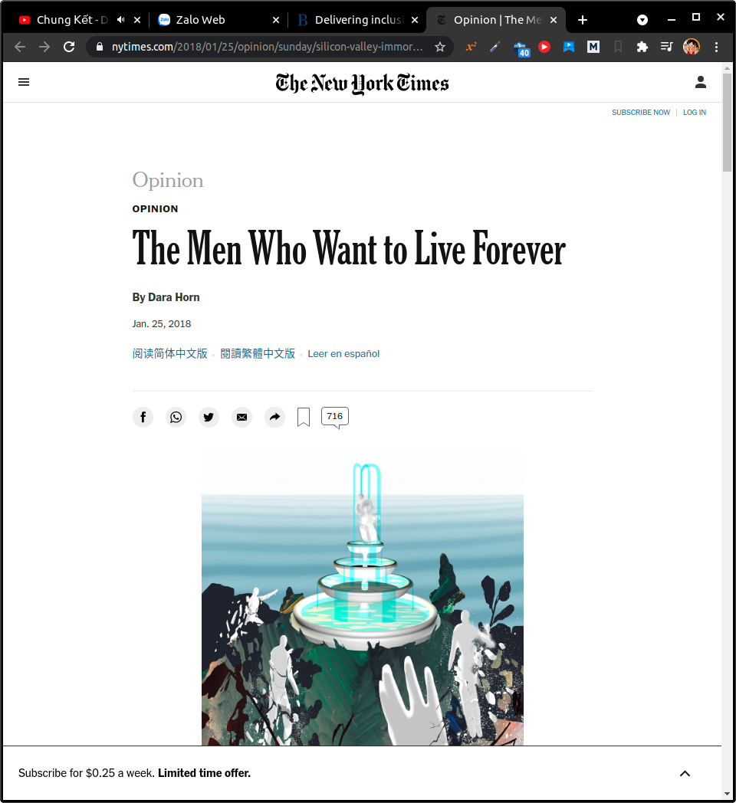
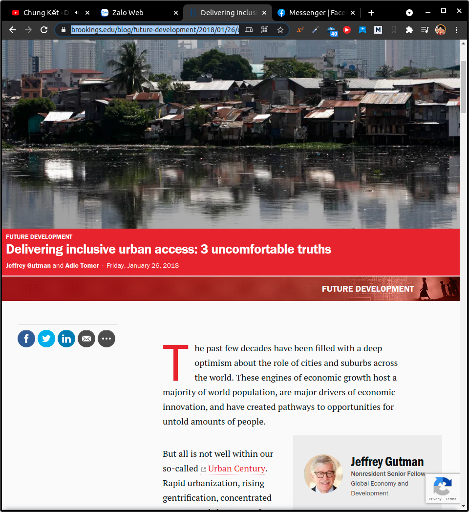
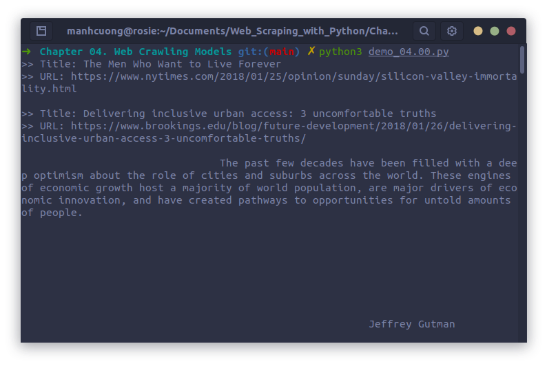
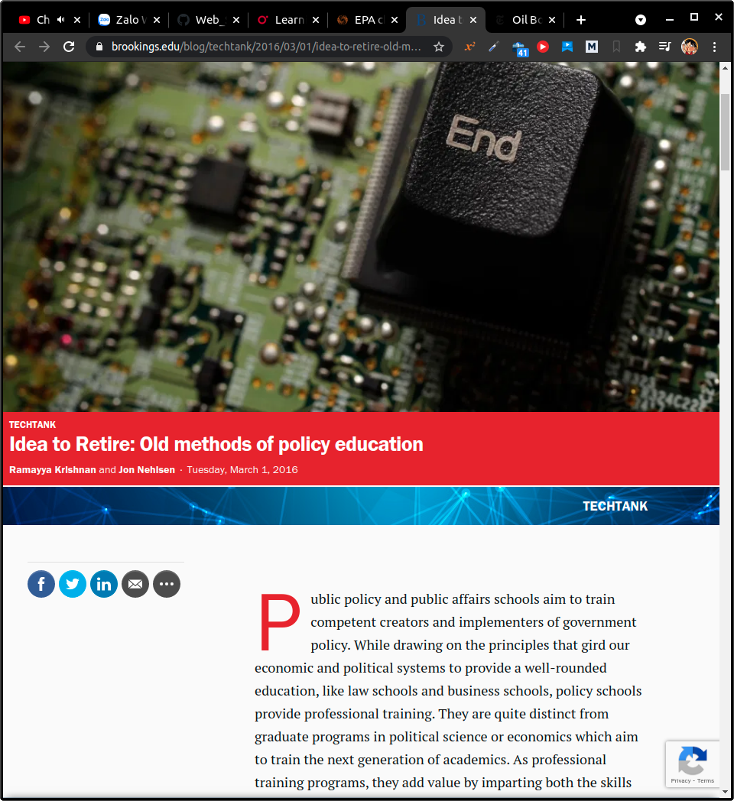
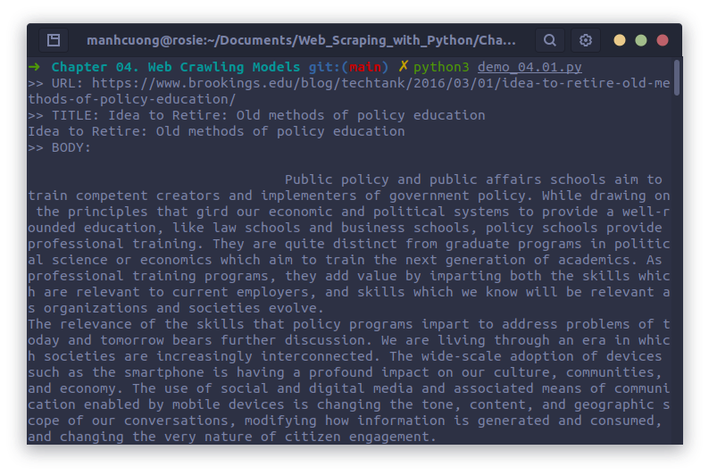

# 1. Planning and Defining Objects
# 2. Dealing with Different Website Layouts
* Chương trình dưới đây sẽ tiến hành craw dữ liệu từ hai trang web dưới đây:
  * [https://www.nytimes.com/2018/01/25/opinion/sunday/silicon-valley-immortality.html](https://www.nytimes.com/2018/01/25/opinion/sunday/silicon-valley-immortality.html)
    
  
  * [https://www.brookings.edu/blog/future-development/2018/01/26/delivering-inclusive-urban-access-3-uncomfortable-truths/](https://www.brookings.edu/blog/future-development/2018/01/26/delivering-inclusive-urban-access-3-uncomfortable-truths/)
    

###### [demo_04.00.py](demo_04.00.py)
```python
import requests
from bs4 import BeautifulSoup

class Content:
    def __init__(self, url, title, body):
        self.url = url
        self.title = title
        self.body = body
        
def getPage(url):
    req = requests.get(url)
    return BeautifulSoup(req.text, "html5lib")

def scrapeNYTimes(url):
    bs = getPage(url)
    title = bs.find("h1").text
    lines = bs.find_all("p", {"class":"story-content"})
    body = "\n".join([lines.text for line in lines])
    
    return Content(url, title, body)

def scrapeBookings(url):
    bs = getPage(url)
    title = bs.find("h1").text
    body = bs.find("div", {"class":"post-body"}).text
    
    return Content(url, title, body)

url = 'https://www.nytimes.com/2018/01/25/opinion/sunday/silicon-valley-immortality.html'
content = scrapeNYTimes(url)
print(">> Title: {}".format(content.title))
print(">> URL: {}".format(content.url))
print(content.body)

url = "https://www.brookings.edu/blog/future-development/2018/01/26/delivering-inclusive-urban-access-3-uncomfortable-truths/"
content = scrapeBookings(url)
print(">> Title: {}".format(content.title))
print(">> URL: {}".format(content.url))
print(content.body)
```


<hr>

* Chương trình dưới đây dùng crawl dữ liệu từ 4 trang web bằng selector.
  * [http://shop.oreilly.com/product/0636920028154.do](http://shop.oreilly.com/product/0636920028154.do)
    

  * [https://www.reuters.com/article/us-usa-epa-pruitt-idUSKBN19W2D0](https://www.reuters.com/article/us-usa-epa-pruitt-idUSKBN19W2D0)
    

  * [https://www.brookings.edu/blog/techtank/2016/03/01/idea-to-retire-old-methods-of-policy-education/](https://www.brookings.edu/blog/techtank/2016/03/01/idea-to-retire-old-methods-of-policy-education/)
    

  * [https://www.nytimes.com/2018/01/28/business/energy-environment/oil-boom.html](https://www.nytimes.com/2018/01/28/business/energy-environment/oil-boom.html)
    
```python
class Content:
    def __init__(self, url, title, body):
        self.url = url
        self.body = body
        self.title = title
        
    def print(self):
        print(">> URL: {}".format(self.url))
        print(">> TITLE: {}".format(self.title))
        print(">> BODY: \n{}".format(self.body))
        
class Website:
    def __init__(self, name, url, titleTag, bodyTag):
        self.name = name
        self.url = url
        self.titleTag = titleTag
        self.bodyTag = bodyTag
        
import requests
from bs4 import BeautifulSoup

class Crawler:
    def getPage(self, url):
        try:
            req = requests.get(url)
        except requests.exceptions.RequestException:
            return None
        
        return BeautifulSoup(req.text, "html5lib")
    
    def safeGet(self, pageObj, selector):
        selectedElems = pageObj.select(selector)

        if selectedElems is not None and len(selectedElems) > 0:
            return '\n'.join([elem.get_text() for elem in selectedElems])

        return ''
    
    def parse(self, site, url):
        bs = self.getPage(url)
        
        if bs is not None:
            title = self.safeGet(bs, site.titleTag)
            body = self.safeGet(bs, site.bodyTag)
            
            if title != "" and body != "":
                content = Content(url, title, body)
                content.print()
                
crawler = Crawler()
siteData = [
    ['O\'Reilly Media', 'http://oreilly.com', 'h1', 'section#product-description'],
    ['Reuters', 'http://reuters.com', 'h1', 'div.StandardArticleBody_body_1gnLA'],
    ['Brookings', 'http://www.brookings.edu', 'h1', 'div.post-body'],
    ['New York Times', 'http://nytimes.com', 'h1', 'p.story-content']
]
websites = []
for row in siteData:
    websites.append(Website(row[0], row[1], row[2], row[3]))
    
crawler.parse(websites[0], 'http://shop.oreilly.com/product/0636920028154.do')
crawler.parse(websites[1], 'http://www.reuters.com/article/us-usa-epa-pruitt-idUSKBN19W2D0')
crawler.parse(websites[2], 'https://www.brookings.edu/blog/techtank/2016/03/01/idea-to-retire-old-methods-of-policy-education/')
crawler.parse(websites[3], 'https://www.nytimes.com/2018/01/28/business/energy-environment/oil-boom.html')
```
