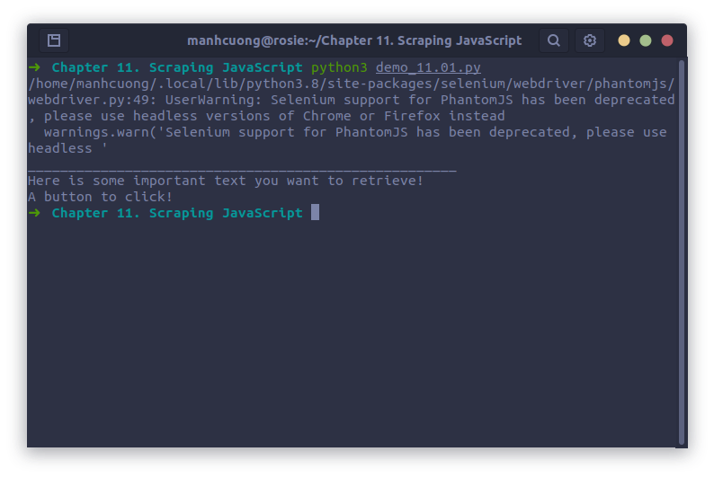

# 1. A Brief Introduction to JavaScript [Giới thiệu ngắn gọn về JavaScript]
## 1.1. Common JavaScript Libraries

# 2. Ajax and Dynamic HTML
## 2.1. Executing JavaScript in Python with Selenium
* Trang này [http://pythonscraping.com/pages/javascript/ajaxDemo.html](http://pythonscraping.com/pages/javascript/ajaxDemo.html) dược xây dựng bằng AJAX, nếu crawl data theo cách truyến thống thì sẽ nhận dc một trang rỗng, nên phải sử dụng **Selenium** để crawl.
* Dưới đây ta sẽ tiến hành crawl data từ trang web trên bằng cách sử dụng Selenium.

###### [demo_11.00.py](demo_11.00.py)
```
from selenium import webdriver
import time

driver = webdriver.PhantomJS()
driver.get("http://pythonscraping.com/pages/javascript/ajaxDemo.html")
time.sleep(3) # tạm dừng 3 giây

print("_________________________________________________")
print(driver.find_element_by_id('content').text)
driver.close()
```


* Phía trên, có một p.thức là `driver.find_element_by_id('content')`, ngoài ra selenium còn có các p.thức khác là:
  * `driver.find_element_by_css_selector('#content')`
  * `driver.find_element_by_tag_name('div')`
  * `driver.find_elements_by_css_selector('#content')`
  * `driver.find_elements_by_css_selector('div')`
* Ngoài ra, nếu bạn vẫn muốn sữ dụng BeautifulSoup để phân tích cú pháp thì có thể sử dụng đoạn code dưới đây:
  ```python
  page_source = driver.page_source
  bs = BeautifulSoup(page_soup, 'html5lib')

  print(bs.find(id='content').get_text())
  ```

<hr>

* Bằng dù đoạn code trên hoạt động, tuy nhiên trong quá trình crawl data có thể xảy ra lỗi do đường truyền mạng nên việc cố định 3 giây sẽ ko phải lúc nào cũng khả khi, code dưới đây sẽ khắc phục điểm yếu này:

###### [demo_11.01.py](demo_11.01.py)
```python
from selenium import webdriver
from selenium.webdriver.common.by import By
from selenium.webdriver.support.ui import WebDriverWait
from selenium.webdriver.support import expected_conditions as EC

driver = webdriver.PhantomJS()
driver.get('http://pythonscraping.com/pages/javascript/ajaxDemo.html')

try:
    elem = WebDriverWait(driver, 10).until(EC.presence_of_element_located((By.ID, 'loadedButton'))) # loadedButton là id của cái button trên web đó, inspect mà coi, dòng này có nghĩa là chờ cho cái button này hiện lên
finally:
    print('_____________________________________________________')
    print(driver.find_element(By.ID, 'content').text)
    driver.close()
```


* Code trên có hai điểm đáng chú ý là `WebDriverWait` và `expected_conditions`, cả hai cái này tạo thành một thứ mà Selenium gọi là **chờ đợi ngầm**.
* Chờ đợi ngầm khác với chờ cứng _(là cái chờ 3 giây đó)_ là nó sẽ để mong đợi một trạng thái nào đó trong DOM xuất hiện trc khi nó tiếp tục làm điều gì đó, trong khi chờ đợi cứng chỉ chờ trong 3 giây thôi. Trong thời gian chờ đợi ngầm, trạng thái của DOM xảy ra dc xác định bởi `expected_conditions`, một vài `expected_conditions` phổ biến của Selenium là:
  * Một hộp cảnh báo bật lên.
  * Một element (chẳng hạn như textbox) dc đưa vào trạng thái đã chọn.
  * Page title thay đổi, một văn bản nào đó xuất hiện trên trang hoặc trong một element nào đó.
  * Một element nào đó xuất hiện hoặc biến mất khỏi DOM.

* Ngoài `By.ID`, còn có: `CLASS_NAME`, `CSS_SELECTOR`, `LINK_TEXT`, `PARTIAL_LINK_TEXT`, `NAME`, `TAG_NAME`, `XPATH`,...

## 2.2. Additional Selenium Webdrivers
